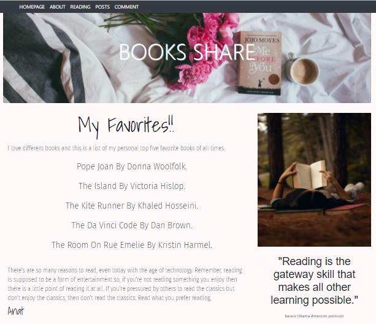
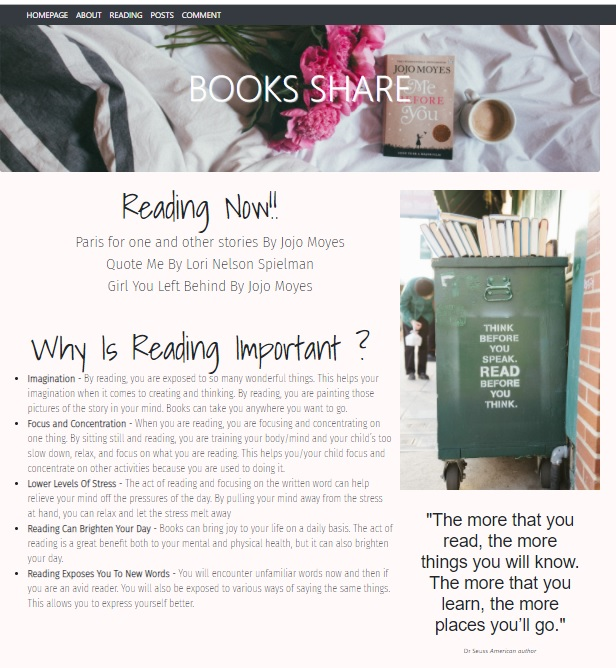

 
### Made By :pencil2:

 Anat

### Name :mag_right:

Book Share

  
### Motivation :muscle:
  
I am a big lover of books, and I love to share my thoughts and opinions on what I read, so I thought it was about time that I created a book blog.
Also and most important the purpose of this blog is to make people be aware of reading importance and the benefits of it.
In all, the importance of a book to help us learn and understand things cannot be underestimated.
Happy reading!
  
### Description :pencil:

The app enables me to add posts and allows registered users comment on each post.The app also displays a book archive and alows users read all past posts.

### Technologies  :computer:
Backend: Python, Flask, MySQL, SQLAlchemy
Frontend: JavaScript,  Jinja2, HTML5, CSS, Bootstrap.
  

